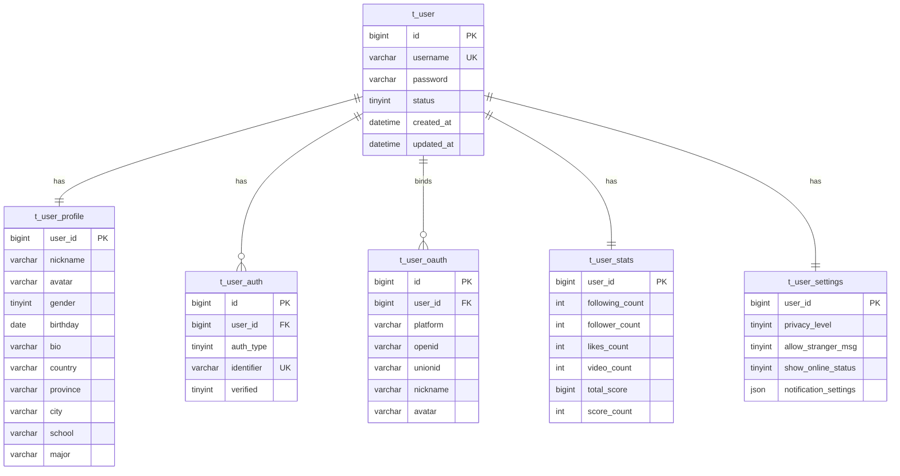

# 用户数据库表设计方案

## 设计目标

基于您的项目特点（类抖音视频平台 + 交友 + 虎扑评分系统），设计一套支持多端（Web、PC、Android、iOS）的用户数据库架构。

## 数据库表结构

## 表设计说明

| 表名 | 说明 | 设计考量 |

|------|------|----------|

| `t_user` | 用户主表 | 核心认证信息，字段最少，便于高频查询 |

| `t_user_profile` | 用户资料表 | 个人详细信息，与主表 1:1 关系 |

| `t_user_auth` | 认证方式表 | 支持手机号/邮箱绑定，一个用户可绑定多种方式 |

| `t_user_oauth` | 第三方登录表 | 微信等OAuth登录信息，便于扩展更多平台 |

| `t_user_stats` | 用户统计表 | 高频更新的统计数据独立存储，预留评分系统字段 |

| `t_user_settings` | 用户设置表 | 隐私和通知设置，使用JSON字段便于扩展 |

## 扩展性考量

1. **用户ID**: 使用 `BIGINT` 支持雪花算法，适合分布式系统
2. **评分系统预留**: `t_user_stats` 表中的 `total_score` 和 `score_count` 为虎扑式评分预留
3. **多平台登录**: `t_user_oauth` 表支持后续添加 QQ、微博、Apple 等登录方式
4. **灵活设置**: 使用 JSON 字段存储通知设置，便于添加新选项

## 文件位置

SQL 文件将创建在 `user-service/sql/` 目录下：

- [`user-service/sql/schema.sql`](user-service/sql/schema.sql) - 建表语句
- [`user-service/sql/init_data.sql`](user-service/sql/init_data.sql) - 初始数据（如有需要）

## 索引策略

- 主键使用 `BIGINT` 类型的自增或雪花ID
- 用户名、手机号、邮箱等查询字段建立唯一索引
- OAuth 平台+openid 建立联合唯一索引
- 创建时间字段建立普通索引，支持按时间排序